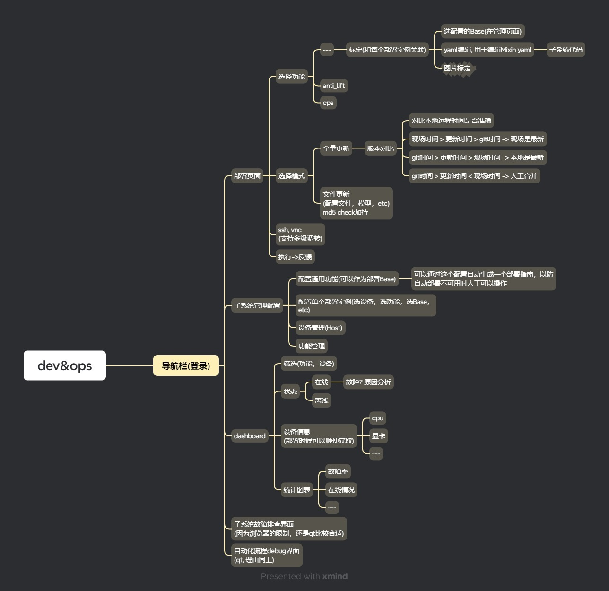

# 基于网页的部署、标定和运维工具项目概述

## 项目背景

开发一个综合性的基于网页的工具,用于管理复杂系统的部署、标定和运维过程。该工具旨在提高操作效率,减少人为错误,并为多个团队提供统一的操作界面。

## 项目目标

1. 开发一个直观、高效的用户界面,集成多个功能模块
2. 实现自动化部署流程,支持多环境配置管理
3. 提供图像标注工具,支持多种标注形状和系统选择
4. 创建实时监控仪表板,展示设备状态和系统健康信息
5. 实现高级YAML配置编辑器,支持复杂配置文件的管理
6. 设计互动式时间线视图,用于跟踪作业轮次和子系统状态
7. 构建系统问题诊断和查询界面,支持历史数据搜索和分析

## 主要功能模块

1. 统一的导航栏和布局系统
2. 部署管理和执行界面
3. 图像标注工具
4. 设备状态仪表板
5. YAML配置编辑器
6. 自动化时间线视图
7. 系统问题查询和诊断界面

## 技术要求

- 前端框架: Vue.js
- UI组件库: Element Plus
- 后端框架: Django
- 数据库: PostgreSQL或者MySQL
- 实时通信: WebSocket
- 版本控制: Git
- 响应式设计,支持桌面和移动设备

## 安全性要求
- 实现用户认证和授权系统
- 所有通信使用HTTPS加密
- 实施适当的输入验证和数据清理
- 遵循OWASP安全指南

## 性能要求

- 页面加载时间不超过3秒
- 支持同时在线用户数不少于100, 且支持并发操作

## 可扩展性

- 模块化设计,便于未来功能扩展
- 支持插件系统,允许第三方功能集成
- 提供API文档,支持与其他系统集成

## 交付物

1. 源代码和技术文档
2. 用户手册和培训材料
3. 部署指南和系统架构文档
4. 测试报告和性能分析报告

## 项目时间线

- 项目启动: T+0周
- 需求分析和设计: T+2周
- 开发阶段: T+10周
- 测试和优化: T+14周
- 部署和验收: T+16周

