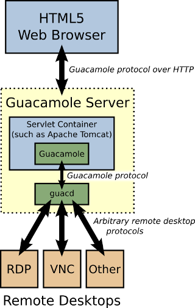

# 部署执行功能规范

## 用户故事

作为一个系统管理员，我想要在一个网页上选择一个或多个部署配置并执行它们，同时能够通过SSH或VNC直接连接到选定的设备，以便能够方便地管理、更新和远程访问多个系统。

## 功能描述

创建一个网页界面，允许用户查看所有可用的部署配置，筛选特定的部署，选择一个或多个配置，触发这些配置的执行，并提供SSH和VNC远程访问功能。

## 详细需求

### 部署列表显示
- 页面应显示来自数据库中 Deployment 表的所有部署配置。
- 每个部署项应显示以下信息：
  - 部署名称 (name)
  - 关联的主机名称 (host)
  - 可更新的功能名称 (updatable_function)
- 使用复选框允许用户选择多个部署。

### 部署筛选功能
- 在部署列表上方添加筛选区域。
- 提供以下筛选选项：
  - updatable_function（可更新功能）：下拉菜单，包含所有可用的功能选项。
  - pier_name（码头名称）：下拉菜单或自动完成输入框，包含所有可用的码头名称。
- 添加"应用筛选"按钮，点击后更新显示的部署列表。
- 添加"重置筛选"按钮，清除所有筛选条件并显示所有部署。
- 筛选后，部署列表应只显示符合条件的Deployment。
- 在列表上方显示当前应用的筛选条件，例如"显示：太仓的所有防吊起部署"。

### 部署选择
- 用户应能通过点击复选框来选择一个或多个部署。
- 提供"全选"和"取消全选"的选项。

### 执行按钮
- 页面底部应有一个明显的"执行部署"按钮。
- 按钮应在至少选择一个部署时才变为可点击状态。

### 执行确认
- 点击"执行部署"按钮后，显示一个确认对话框。
- 确认对话框应列出所有选中的部署，并请求用户确认操作。

### 部署执行
- 确认后，系统应依次执行每个选中的部署。
- 执行过程应考虑 Deployment 模型中定义的所有相关配置，包括跳板机设置。

### 执行状态显示
- 在执行过程中，页面应实时更新每个部署的执行状态。
- 显示每个部署的执行进度，如"准备中"、"执行中"、"完成"或"失败"。

### 执行日志
- 为每个执行的部署提供详细的日志查看选项。
- 日志应包含执行的每个步骤，包括文件传输、命令执行等。

### 错误处理
- 如果部署执行过程中出现错误，应清晰地显示错误信息。
- 提供重试选项重复执行失败的部署。

### SSH 和 VNC 访问功能
- 在每个部署项旁边添加 SSH 和 VNC 按钮。
- 点击按钮后，在新的标签页或窗口中打开相应的远程访问界面。
- SSH 连接应使用网页版终端模拟器。
- VNC 连接应使用兼容的 Web VNC 客户端。
- 连接前应验证用户权限。

### 远程连接日志记录
- 记录每次 SSH 和 VNC 连接的以下信息：
  - 连接类型（SSH 或 VNC）
  - 用户ID
  - 目标设备信息
  - 连接开始和结束时间
  - 连接持续时间
- 提供管理员查看连接日志的界面。

### 管理口的连接

### 更新提醒功能
- 如果有重大的bug fix或安全更新，管理员可以设置提醒功能，在每个部署项旁边添加一个提醒按钮。
- 提醒应依据版本的时间戳，如果有新的版本，提醒按钮应显示一个红色的小圆点。

## 技术考虑

### 前端
- 使用 Vue.js 和 Element Plus 构建用户界面。
- 实现响应式设计，确保在不同设备上的可用性。
- 实现动态筛选功能，使用Vue.js的计算属性或方法来处理筛选逻辑。
- 使用Element Plus的Select组件来创建筛选下拉菜单。

### 后端
- 使用 Django 后端处理部署执行请求。
- 实现 RESTful API 端点来处理部署选择和执行。
- 实现API端点以提供可用的updatable_function和pier_name选项。
- 优化查询以支持高效的筛选操作，考虑使用数据库索引提高性能。

### 实时更新
- 使用 WebSocket 或长轮询来实现执行状态的实时更新。

### 安全性
- 实现适当的身份验证和授权机制，确保只有授权用户才能访问此功能。
- 在后端验证所有用户输入，防止潜在的安全漏洞。

### 远程访问集成
- 集成开源的Web SSH 客户端，<del>如webssh2</del>
- 集成开源的 Web VNC 客户端，<del>如 noVNC()</del>
- 实现安全的认证机制，确保只有授权用户可以建立远程连接。
- 能够实现多级跳板机的连接，以支持复杂的网络拓扑(Apache Guacamole)。

- 使用反向代理(如Nginx或Apache)和来实现单点登录(SSO)，实现和django admin的统一认证

### 日志管理
- 设计并实现远程连接日志数据库模型。
- 创建后端 API 用于记录和检索日志数据。
- 实现日志查询和过滤功能。

## 验收标准

1. 用户能够查看所有可用的部署配置。
2. 用户能够选择一个或多个部署配置。
3. "执行部署"按钮仅在选择至少一个部署时可用。
4. 执行确认对话框正确显示所有选中的部署。
5. 系统能够成功执行选中的部署，并正确处理所有相关配置（如跳板机）。
6. 执行状态实时更新，并且用户可以查看详细的执行日志。
7. 系统能够适当处理和显示执行过程中的错误。
8. 界面在桌面和移动设备上都能正常工作。
9. 只有授权用户才能访问和使用此功能。
10. 用户能够使用updatable_function和pier_name对部署列表进行筛选。
11. 筛选功能正确显示符合条件的部署，并准确反映当前筛选状态。
12. "重置筛选"按钮能够清除所有筛选条件并显示完整的部署列表。
13. 用户能够通过点击 SSH 或 VNC 按钮，在新的标签页中打开相应的远程连接界面。
14. SSH 和 VNC 连接能够成功建立，并提供预期的远程访问功能。
15. 系统能够准确记录所有远程连接的详细信息。
16. 管理员能够查看和搜索远程连接日志。

## 未来优化考虑

1. 扩展筛选功能，允许用户根据更多字段（如主机IP、设备编号等）进行筛选。
2. 添加部署执行的调度功能，允许用户设置未来的执行时间。
3. 实现部署配置的版本控制和回滚功能。
4. 提供部署执行的性能分析和报告功能。
5. 实现远程连接会话的录制和回放功能，用于审计和培训目的。
6. 添加远程连接的性能监控和报告功能，帮助识别潜在的网络或系统问题。
7. 实现基于角色的访问控制（RBAC），细化不同用户对SSH和VNC功能的访问权限。